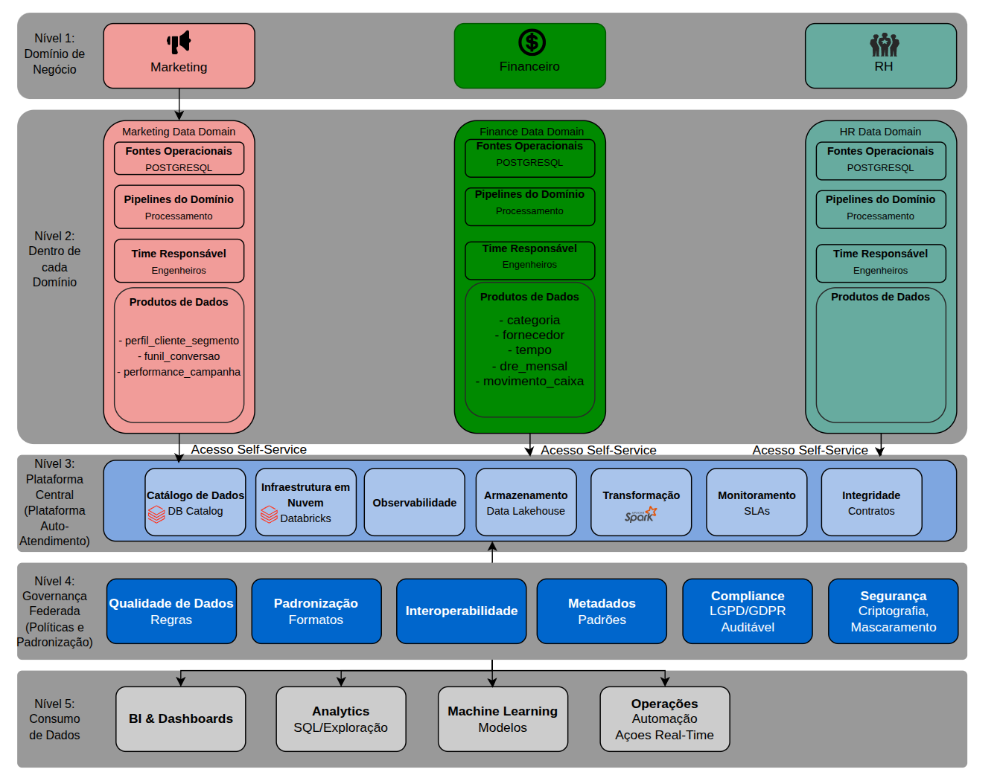
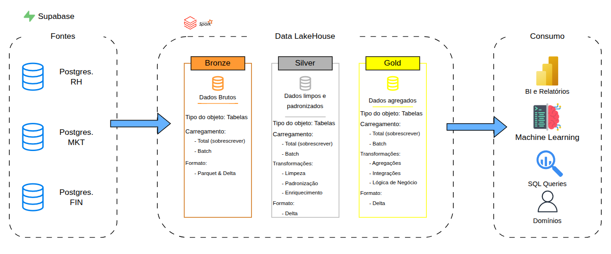
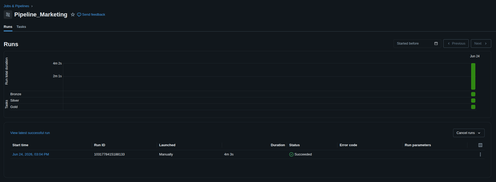
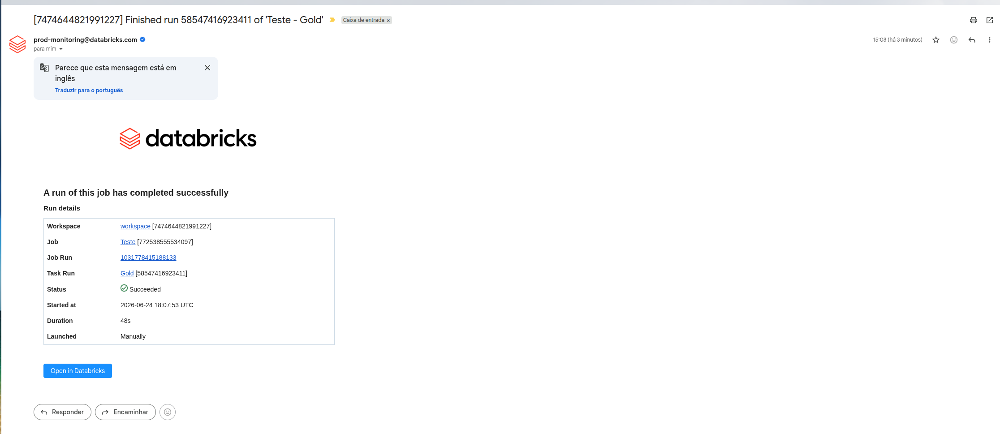

# Projeto Data-Mesh


## 🏛️ Arquitetura DataMesh



## 🏅 Arquitetura Medalhão



## 🔐 Configuração de Segredos e Ambiente

Devido às limitações da versão **Databricks Community Edition**, que não suporta o uso nativo de `dbutils.secrets`, implementamos uma solução baseada em variáveis de ambiente para a gestão de credenciais.

### 🛠️ Funcionamento
1. **Segurança:** Utilizamos o arquivo `00_common/config_env.py` para definir os segredos. Este arquivo está listado no `.gitignore` e **nunca** deve ser enviado ao repositório para evitar o vazamento de senhas.
2. **Injeção de Dependência:** O arquivo deve ser carregado no cluster no início de cada execução através do comando `%run`.

### 📝 Exemplo de Conteúdo (`config_env.py`)

Cada colaborador deve criar este arquivo localmente na pasta `00_common/` seguindo o padrão abaixo:

```python
import os

# Credenciais de Marketing
os.environ["SUPABASE_USER"] = "usuario_marketing"
os.environ["SUPABASE_PASS"] = "senha_secreta_123"
os.environ["SUPABASE_HOST"] = "host_do_supabase"
os.environ["SUPABASE_DB"] = "postgres"
```

## 📂 Estrutura do Repositório

O projeto está organizado seguindo os princípios de **Data Mesh**, onde cada domínio (Marketing, Finanças e RH) é responsável por seu próprio pipeline, consumindo recursos compartilhados da pasta `00_common`.

```text
.
├── common/               # Recursos compartilhados (Core do Framework)
|   ├── BaseParquetSyncPipelineClass.py     # Salvando em Parquet para comparação
│   ├── BasePipelineClass.py                # Base herdada com configurações base
|   ├── BronzePipelineClass.py              # Pipeline Bronze (Medallion)
|   ├── SilverPipelineClass.py              # Pipeline Silver (Medallion)
|   ├── GoldPipelineClass.py                # Pipeline Gold (Medallion)
|   ├── MeshContractEnforcer.py             # Garante a integridade segundo o schema
│   └── config_env.py                       # Variavéis de ambiente e segredos (não deve ser enviada ao repositório)
│
├── marketing/            # Domínio de Marketing
│   ├── bronze/
|   ├── silver/
|   ├── gold/
│   └── tests/               # Testes unitários do domínio
│
├── financas/             # Domínio de Finanças
│   ├── bronze/
|   ├── silver/
|   ├── gold/
│   └── tests/
│
├── recursos_humanos/     # Domínio de Recursos Humanos
│   ├── bronze/
|   ├── silver/
|   ├── gold/
│   └── tests/
│
├── gold_global/                # Camada Gold Transversal (Cross-Domain)
│   └── fato_vendas.py          # Tabela Fato unindo os 3 domínios
│
├── docs/                    # Documentação da Modelagem
|   ├── arquitetura/        # Diagramas (ex: fluxo Medallion no Mesh)
│   ├── dominios/           # Regras de negócio específicas (Marketing, RH)
|
├── Contratos/               # Arquivos YAML dos contratos de dados
|
├── datasets/                # Datasets usados
|   ├── recursos_humanos/    # Datasets de rh
|   ├── financas/            # Datasets de financas
|   ├── marketing/           # Datasets de marketing
│
├── .gitignore               # Arquivos ignorados (tokens, logs, pycache)
├── requirements.txt         # Dependências do projeto (pyspark, etc)
└── README.md                # Documentação principal 
```

## 📊 Compressão de Dados

Os dados estão no formato CSV em sua origem, eles são salvos no DataBricks no formato Parquet e Delta por motivos de comparação entre a compressão dos dados.


## Pipeline Automatizada

As pipelines são automatizadas no próprio DataBricks similar ao Apache Airflow.



## ✉️ Mensageria

O próprio DataBricks oferece um sistema de mensageria para alertas em casos como inicio, sucesso, falha e outros casos.

